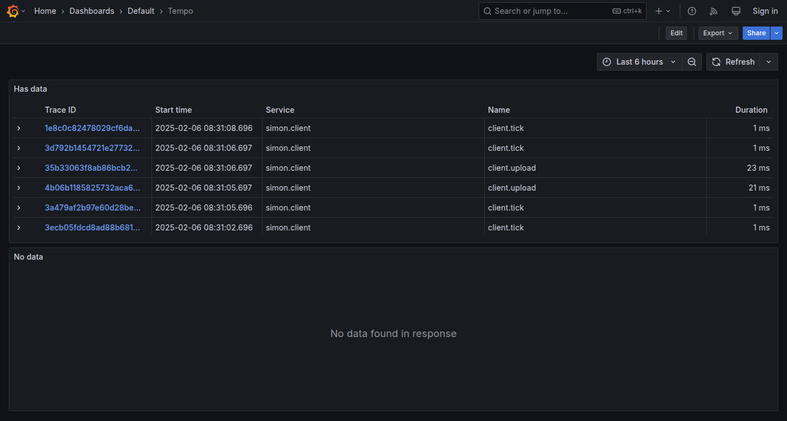
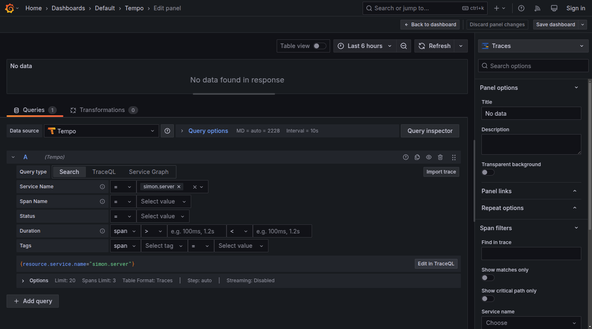
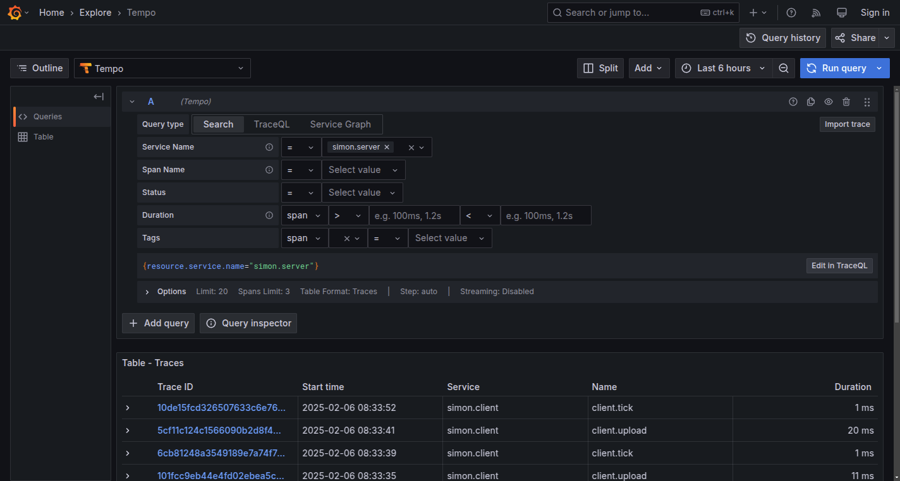
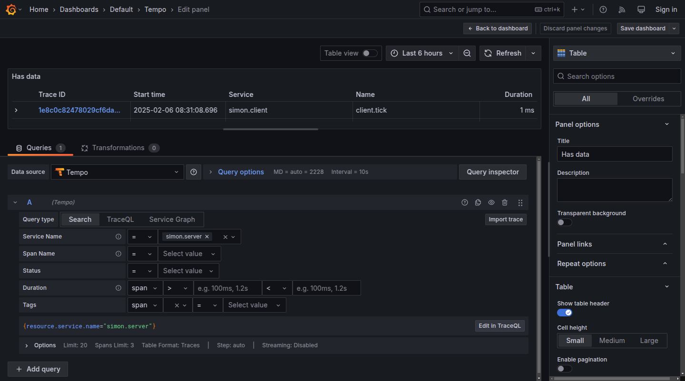

# Reproduction of traces dashboard bug

## Start

```bash
docker compose up -d
```

See http://localhost:3000/d/tempo/tempo



The "No data" panel was added via "Add visualisation" menu on dashboard edit.



However, the traces are present in the "Explore" view.



The "Has data" panel was added from "Explore", "Add to dashboard" button.



## Cleanup

```bash
docker compose down --timeout 1
```
